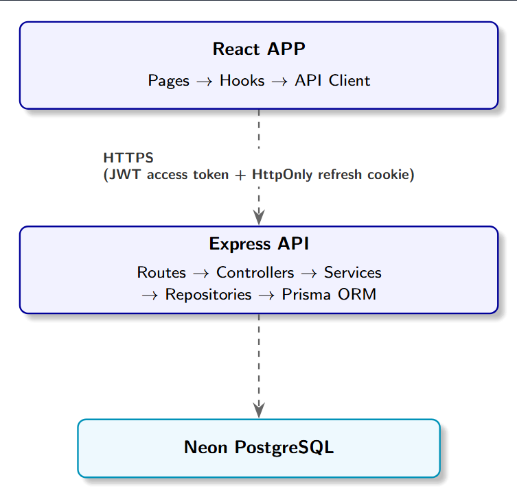

# Mayzax ATS

**Mayzax ATS** is a production-grade Recruitment Applicant Tracking System built for **Mayzax Solutions**. It lets Admins manage recruiters and candidate profiles, lets Recruiters log job applications against their assigned profiles, and gives Admins a real-time analytics dashboard — all keyed off Mayzax's night-shift **business date** instead of the calendar date.

**You can view the Work Based Structure here: [Mayzax_WBS](./docs/Mayzax_WBS.xlsx)
---

## Table of Contents

1. [Architecture](#architecture)
2. [Tech Stack](#tech-stack)
3. [Project Structure](#project-structure)
4. [Database Schema](#database-schema)
5. [Getting Started](#getting-started)
6. [Environment Variables](#environment-variables)
7. [API Reference](#api-reference)
8. [Deployment Checklist](#deployment-checklist)

---

## Architecture

Mayzax ATS follows **clean architecture** with a clear separation of concerns on both tiers:



## Tech Stack

| Layer | Technology |
| --- | --- |
| Frontend | React 18 + TypeScript + Vite + Tailwind CSS + shadcn/ui (Radix primitives) |
| State/Data | React Hook Form + Zod (forms) |
| Backend | Node.js + Express + TypeScript |
| Database | Neon PostgreSQL |
| ORM | Prisma |
| Auth | JWT (access + refresh) with rotation, bcrypt, HttpOnly cookies |
| Validation | Zod (shared conventions front & back) |
| Logging | Pino / pino-http |

---

## Project Structure

```
mayzax-ats/
├── backend/
│   ├── prisma/
│   │   ├── schema.prisma          # Full DB schema (models, enums, constraints)
│   │   ├── seed.ts                # Creates ONLY the initial Admin account (no mock data)
│   │   └── migrations/            # Versioned SQL migrations
│   ├── src/
│   │   ├── config/env.ts          # Zod-validated environment config
│   │   ├── lib/                   # prisma client singleton, logger
│   │   ├── middleware/            # auth, validate, errorHandler, rateLimiter, requestLogger
│   │   ├── modules/
│   │   │   ├── auth/              # login, refresh, logout, me, change-password
│   │   │   ├── recruiters/        # Admin recruiter management + stats
│   │   │   ├── profiles/          # Client profile CRUD + assignment
│   │   │   ├── applications/      # Job applications + duplicate detection
│   │   │   ├── analytics/         # Admin dashboard, breakdowns, daily counts
│   │   │   └── shared/            # audit logging service
│   │   ├── routes/index.ts        # API v1 router aggregation
│   │   ├── utils/                 # apiError, asyncHandler, businessDate, normalizeJobLink
│   │   ├── app.ts                 # Express app wiring (helmet, cors, rate-limit, routers)
│   │   └── server.ts              # Process entrypoint, graceful shutdown
│   ├── .env.example
│   ├── package.json
│   └── tsconfig.json
├── docs/
│   └── arch.png                   # Project Flow Diagram
│   └── Mayzax_WBS.xlsx            # Project Work Based Structure with completion status.
│   └── API_Documentation.md 
├── frontend/
│   ├── public/                    # Public Resources
│   ├── src/
│   │   ├── assets/                          # Assets Directory
│   │   ├── components/{ui,layout,shared,motion}/   # shadcn primitives + app shell + reusable states
│   │   ├── context/auth-context.tsx         # Auth provider (silent refresh, session state)
│   │   ├── hooks/                           # Query hooks per domain
│   │   ├── lib/                             # axios client w/ refresh interceptor, utils
│   │   ├── pages/                           # Route-level pages
│   │   ├── routes/protected-route.tsx       # RBAC route guarding
│   │   └── types/                           # Shared TS types mirroring API contracts
│   ├── .env.example
│   ├── tailwind.config.ts         # Mayzax brand palette (blue/green from logo)
│   └── package.json
├── package.json                   # Root orchestration scripts (setup/dev/build/lint for both apps)
└── README.md                      # ← you are here
```

## Database Schema

Defined in `backend/prisma/schema.prisma`. Key models:

### `User`

```
id, name, email (unique), passwordHash, role (ADMIN|RECRUITER),
isActive, deletedAt (soft delete), lastActiveAt, createdById (self-relation),
createdAt, updatedAt
```

### `RefreshToken`

```
id, userId (FK), tokenHash (unique, SHA-256 — raw tokens are never stored),
userAgent, ip, expiresAt, revokedAt, replacedByTokenHash, createdAt
```

### `ClientProfile`

```
id, candidateName, email, phone, technology, notes,
assignedRecruiterId (FK → User, nullable),
isActive, deletedAt (soft delete), createdAt, updatedAt
```

### `JobApplication`

```
id, profileId (FK), recruiterId (FK), jobLink, normalizedJobLink,
companyName, jobTitle, jobPortal (enum), status (enum),
appliedAt, businessDate (DATE),
createdAt, updatedAt

UNIQUE (profileId, normalizedJobLink)   ← duplicate-detection constraint
INDEX  (recruiterId), (profileId), (businessDate), (status)
```

### `AuditLog`

```
id, userId (FK, nullable), action, entity, entityId, metadata (JSON),
ip, userAgent, createdAt

```

Enums: `Role {ADMIN, RECRUITER}`, `ApplicationStatus {APPLIED, IN_REVIEW, SHORTLISTED, INTERVIEW_SCHEDULED, INTERVIEWED, OFFERED, REJECTED, WITHDRAWN, ON_HOLD}`, `JobPortal {LINKEDIN, INDEED, NAUKRI, DICE, MONSTER, ZIPRECRUITER, GLASSDOOR, COMPANY_WEBSITE, CAREERBUILDER, OTHER}`.

---

## Getting Started

### Prerequisites

- Node.js ≥ 18
- PostgreSQL ≥ 14
- npm ≥ 9

The root `package.json` provides orchestration scripts so you rarely need to `cd` into `backend/` or `frontend/` directly.

### Fastest path: one-command setup

```bash
git clone <repo-url> mayzax-ats
cd mayzax-ats
npm run install:all           # installs required node modules
```

Create `backend/.env` & `frontend/.env` afterwards and set real values for various environment variables
Then run below command for project setup

```bash
npm run setup          
```

The seed step prints the generated admin credentials — **log in and change the password immediately** (see `POST /auth/change-password`).
Use below command to seed sample data in DB

```bash
SEED_DEMO_DATA=true npm run seed         
```

### Run in development

```bash
npm run dev
```

This runs the API and the web app **concurrently** in one terminal, with color-coded `[API]` / `[WEB]` log prefixes:

- API → `http://localhost:4000/api/v1`
- Web → `http://localhost:5173`

Or run them separately in two terminals if you prefer:

```bash
npm run dev:backend     # API only
npm run dev:frontend    # Web app only
```

## Environment Variables

### Backend (`backend/.env`)

| Variable | Description | Default |
| --- | --- | --- |
| `NODE_ENV` | `development` \| `test` \| `production` | `development` |
| `PORT` | API port | `4000` |
| `API_PREFIX` | Version prefix for all routes | `/api/v1` |
| `CLIENT_URL` | Allowed CORS origin | `http://localhost:5173` |
| `DATABASE_URL` | Postgres connection string(pooler) | — (required) |
| `DIRECT_URL` | Postgres connection string(direct) | — (required) |
| `JWT_ACCESS_SECRET` | Secret for signing access tokens | — (required) |
| `JWT_REFRESH_SECRET` | Secret for signing refresh tokens | — (required) |
| `JWT_ACCESS_EXPIRES_IN` | Access token TTL | `15m` |
| `JWT_REFRESH_EXPIRES_IN` | Refresh token TTL | `7d` |
| `COOKIE_DOMAIN` | Cookie domain | `localhost` |
| `COOKIE_SECURE` | `true` in production (HTTPS only) | `false` |
| `BUSINESS_SHIFT_START_HOUR` / `_MINUTE` | Shift start (IST) | `19` / `30` |
| `BUSINESS_SHIFT_END_HOUR` / `_MINUTE` | Shift end (IST) | `4` / `30` |
| `BUSINESS_TIMEZONE` | IANA timezone for shift math | `Asia/Kolkata` |
| `RATE_LIMIT_WINDOW_MS` / `RATE_LIMIT_MAX` | Global rate limiting | `900000` / `300` |
| `AUTH_RATE_LIMIT_MAX` | Stricter limit on `/auth/*` | `20` |
| `LOG_LEVEL` | Pino log level | `info` |
| `LOGS_DIR` | Directory for daily rotating log files (`${LOGS_DIR}/YYYY-MM-DD.log`) | `logs` |
| `SEED_ADMIN_EMAIL/PASSWORD/NAME` | Used only by `prisma/seed.ts` | see `.env.example` |
| `SEED_DEMO_DATA` | Used to seed sample data in DB | `false` initially can be overwriiten |

### Frontend (`frontend/.env`)

| Variable | Description | Default |
| --- | --- | --- |
| `VITE_API_BASE_URL` | Base URL of the backend API | `http://localhost:4000/api/v1` |

---

## API Reference

All routes are versioned under `API_PREFIX` (default `/api/v1`). Responses follow a consistent envelope:

```json
// Success
{ "success": true, "data": ..., "pagination": { ... } }

// Failure
{ "success": false, "error": { "code": "...", "message": "...", "details": ... } }
```

### Auth (`/auth`)

| Method | Path | Auth | Description |
| --- | --- | --- | --- |
| POST | `/auth/login` | Public | Email + password login. Sets HttpOnly `access_token` / `refresh_token` cookies and returns an access token for header-based use. |
| POST | `/auth/refresh` | Cookie | Rotates the refresh token, issues a new pair. Detects token reuse and revokes all sessions if triggered. |
| POST | `/auth/logout` | Required | Revokes the current refresh token, clears cookies. |
| GET | `/auth/me` | Required | Returns the current authenticated user. |
| POST | `/auth/change-password` | Required | Changes password, revokes all existing sessions. |

### Recruiters (`/recruiters`) — Admin only

| Method | Path | Description |
| --- | --- | --- |
| GET | `/recruiters` | List recruiters — search, filter by role/isActive, sort, paginate. |
| POST | `/recruiters` | Create a recruiter or admin account. |
| GET | `/recruiters/:id/stats` | Assigned profiles, total applications, current-shift applications, profile-wise counts, last active. |
| PATCH | `/recruiters/:id` | Update name/email/role. |
| PATCH | `/recruiters/:id/status` | Activate/deactivate. |
| DELETE | `/recruiters/:id` | Soft delete (unassigns their profiles). |

### Client Profiles (`/profiles`)

| Method | Path | Auth | Description |
| --- | --- | --- | --- |
| GET | `/profiles` | Any | List — recruiters see only their assigned profiles; admins see all, with search/filter/sort. |
| GET | `/profiles/:id` | Any | Fetch a single profile (recruiters restricted to their own). |
| POST | `/profiles` | Any | Create a candidate profile. |
| PATCH | `/profiles/:id` | Any | Update profile fields (recruiters can't reassign). |
| PATCH | `/profiles/:id/assign` | Admin | Reassign to a different recruiter (or unassign). |
| DELETE | `/profiles/:id` | Admin | Soft delete. |

### Job Applications (`/applications`)

| Method | Path | Auth | Description |
| --- | --- | --- | --- |
| GET | `/applications` | Any | List — recruiters see only their own; search/filter by status, portal, business date range. |
| GET | `/applications/check-duplicate` | Any | Pre-flight duplicate check for instant UI feedback. |
| GET | `/applications/:id` | Any | Fetch a single application. |
| POST | `/applications` | Any | Create an application. Enforces duplicate protection (see above). |
| PATCH | `/applications/:id` | Any | Update status/company/title/portal. |

### Analytics (`/analytics`) — Admin only

| Method | Path | Description |
| --- | --- | --- |
| GET | `/analytics/summary` | Global counts: recruiters, active recruiters, profiles, applications, current-shift applications. |
| GET | `/analytics/dashboard` | Per-recruiter rollup: assigned profiles, total applications, current-shift applications, last active. Search/sort/paginate. |
| GET | `/analytics/dashboard/:id/breakdown` | Expandable view: profile-wise application counts + recent applications for one recruiter. |
| GET | `/analytics/daily-counts` | Daily application counts grouped by **business date**, optionally filtered by recruiter and date range — powers trend charts. |

### Health

| Method | Path | Description |
| --- | --- | --- |
| GET | `/health` | Liveness check. |

**The detailed API documentation can be viewed here : [API Documentation](./docs/API_DOCUMENTATIONS.md)
---

## Deployment Checklist

Before going to production:

1. Set `NODE_ENV=production`.
2. Generate strong, unique `JWT_ACCESS_SECRET` / `JWT_REFRESH_SECRET` (`openssl rand -hex 32`).
3. Set `COOKIE_SECURE=true` and serve over HTTPS (required for `Secure` cookies to work).
4. Point `DATABASE_URL` amd `DIRECT_URL`at a managed/production Postgres instance.
5. Run `npm run seed` once against production to create the first Admin, then **change that password immediately**.
6. Set `CLIENT_URL` to your production frontend origin (CORS).
7. Set `VITE_API_BASE_URL` to your production API URL and rebuild the frontend.
8. Put the API behind a reverse proxy / load balancer that forwards `X-Forwarded-For` (the app trusts proxy hop `1`).
9. Review `RATE_LIMIT_*` values for expected production traffic.
10. Ship logs (`pino` JSON output) to your log aggregator of choice.

---
